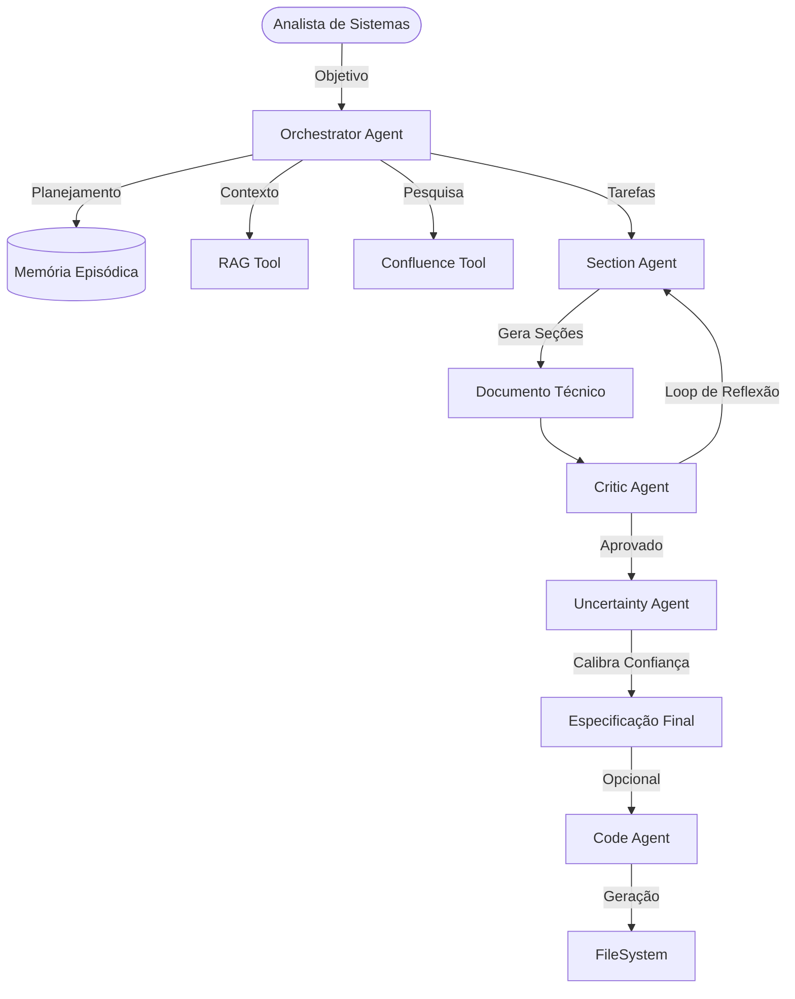

# 🤖 AI Agent Orchestrator

[](https://openjdk.org/)
[](https://spring.io/projects/spring-boot)
[](https://github.com/langchain4j/langchain4j)
[](https://www.postgresql.org/)
[](http://swagger.io/)

Um ecossistema avançado de agentes de IA projetado para automatizar a geração de **especificações técnicas** de alta fidelidade (padrão IFPUG). Utiliza arquitetura multi-agente com ciclos de raciocínio, reflexão crítica, memória episódica e integração RAG.

---

## 🏛️ Arquitetura do Sistema

O orquestrador coordena uma equipe de especialistas para transformar um objetivo de negócio em uma especificação detalhada e código funcional.



### 👥 A Equipe de Agentes

| Agente | Persona | Responsabilidade |
|:-------|:--------|:-----------------|
| **Orchestrator** | Gestor de Projeto | Planeja o documento, coordena pesquisas no Confluence/RAG e define as tarefas. |
| **Section Analyst** | Especialista Técnico | Escreve seções individuais (Contexto, Implementação, PF) com precisão cirúrgica. |
| **System Critic** | Revisor Sênior | Valida o padrão IFPUG, completude técnica e consistência entre seções. |
| **Uncertainty Analyst**| Avaliador de Risco | Detecta "alucinações" e calibra o nível de confiança (ALTA/MÉDIA/BAIXA). |
| **Code Architect** | Desenvolvedor Fullstack | Transforma a especificação aprovada em código-fonte funcional. |

---

## ✨ Principais Recursos

- **🔄 Loop de Reflexão com Convergência**: O `CriticAgent` revisa o trabalho até 3 vezes. Se detectar que os mesmos problemas persistem (≥72% de similaridade), interrompe o loop para intervenção humana, otimizando custos e tempo.
- **🧠 Memória Episódica**: O sistema "aprende" com especificações passadas. Documentos aprovados são indexados e recuperados via busca vetorial/palavras-chave para servir de referência.
- **🔗 Integração Confluence Real-time**: Busca e leitura direta de páginas de negócio no Atlassian Confluence para extração de regras de negócio atualizadas.
- **📡 Streaming SSE (Server-Sent Events)**: Acompanhe o raciocínio dos agentes em tempo real através de logs detalhados de pensamento e uso de ferramentas.
- **📄 Gestão de Prompts Desacoplada**: Todos os system prompts e instruções são externalizados em arquivos de template, facilitando o ajuste fino sem alteração de código.

---

## 🚀 Como Começar

### Pré-requisitos
- Java 21+
- PostgreSQL
- Chave de API OpenAI

### 1. Configuração do Ambiente
Copie o arquivo de exemplo e preencha suas chaves:
```bash
cp .env.example .env
```
Edite o `.env` com suas credenciais:
- `OPENAI_API_KEY`
- `CONFLUENCE_URL`, `CONFLUENCE_EMAIL`, `CONFLUENCE_API_TOKEN`
- `DB_USERNAME`, `DB_PASSWORD`

### 2. Execução
```bash
./mvnw spring-boot:run
```

### 3. Documentação da API
Acesse o Swagger UI para explorar os endpoints:
👉 [http://localhost:8090/swagger-ui.html](http://localhost:8090/swagger-ui.html)

---

## 🛠️ Stack Tecnológica

- **Core**: Spring Boot 3.4.1, Java 21
- **AI Framework**: LangChain4j (com integração OpenAI e MCP)
- **Database**: PostgreSQL + Flyway (Migrações Gerenciadas)
- **Documentação**: SpringDoc OpenAPI (Swagger)
- **Logging**: SLF4J + Logback com streaming SSE via `AgentIO`

---

## 📁 Estrutura do Projeto

```text
src/main/java/com/jdeveloperweb/aiagent/
├── agent/       # Interfaces dos Agentes (Identity & Contract)
├── controller/  # Endpoints REST e Fluxo SSE
├── service/     # Orquestração, Memória e Lógica de Negócio
├── tool/        # Ferramentas (@Tool) acessíveis pelos agentes
├── dto/         # Objetos de transferência e estado da sessão
└── model/       # Entidades JPA (Sessões e Logs)

src/main/resources/
├── prompts/     # Templates de Prompts (Desacoplados)
├── db/migration # Scripts Flyway (Evolutionary Database Design)
└── application.yml
```

---

## 🤝 Contribuição
1. Faça um Fork do projeto
2. Crie uma Branch para sua feature (`git checkout -b feature/NovaFeature`)
3. Commit suas mudanças (`git commit -m 'feat: Adiciona NovaFeature'`)
4. Push para a Branch (`git push origin feature/NovaFeature`)
5. Abra um Pull Request

---
Desenvolvido com ❤️ pela equipe de IA da **Prognum**.
